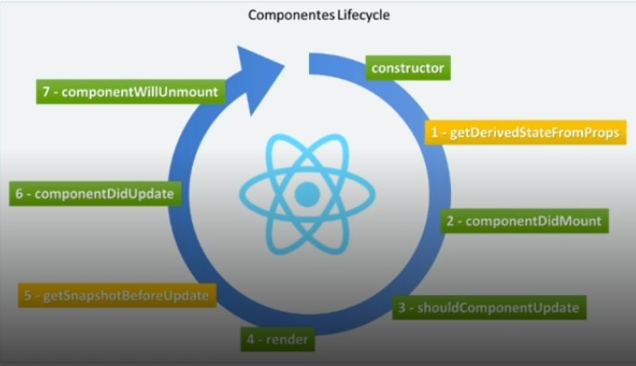

# Como criar um projeto React?


[React](https://reactjs.org/)

1. No meu terminai eu vou digitar: *npx create-react-app nome-do-meu-projeto*
 - O npx é um pacote do npm que vai baixar, toda vez que iniciado, o repositório da versão mais recente do REACT. OBS..: Eu posso usar o npm no lugar do npx sem problema algum;

  - Depois disso, vai criar dentro da minha pasta um ambiente do React.
<br><br>


## pastas

<br>

#### node_modules

- Tem todas as dependências e bibliotecas que vão ser usadas no nosso projeto.

<br><br>

#### public 

- Arquivos principais do meu react; 
- Estrutura PWA;
- Tem um arquivo estatico que vai renderizando componentes;
- Cada página da nossa aplicação vai ser praticamente um componente;
- Tem dentro dele o nosso index, que será a nossa página principal, como se fosse o nosso ponto de partida do projeto.

<br><br>

#### src

<br>
- É praticamente a pasta onde ira ficar os nossos arquivos js, css, imgs, etc...

- existe detro dele o arquivo index.js:

  -  Ele é o ponto de entrada do meu React, pois, ele vai ser o primeiro arquivo que o meu react vai pegar e começar a pegar lógica nele;
  - Ele possui o root, que vai apontar para o meu root do index.html;
  - Tudo que tiver no tempo de execução, ele vai redenrizar os arquivos do React, ou seja, os componentes;
  - Ele vai manipular a árvore DOM.

  <br>
- app.js:

  - Dentro dele tem uma função que devolve um HTML; Isso se chama de JSX;
  - Ele só tem algumas diferenças pequenas;
  - Ele também faz a importação da minha logo e do meu CSS. 

<br><br>

#### package.json

- É o arquivo que será usado para saber todas as dependências que se têm no nosso projeto;

- Ao passar do tempo que vamos escalando bibliotecas ele vai adicionando nas dependências.

<br><br>

# OBS:

1. Como padrão do React todo componente deve iniciar como letra maiúsucla. Exemplo:
```JS
const root = ReactDOM.createRoot(document.getElementById('root'));
root.render(
  <React.StrictMode>
    <App />
  </React.StrictMode>
);

```
Ele é meio que uma tag nova.

<br><br>

# Como rodar o nosso projeto?

1. Abre o terminal;
2. Entra na pasta do projeto;
3. Coloca no terminal --> npm run start;
4. Ele ja vai rodar o nosso projeto e vai abrir um servidor na web para ele.

<br>

# Componentes de classe

Básicamente tudo dentro do React é um componente;

Existe algumas formas diferentes de criar Componentes:
Até a versão 15 do react só existia componentes de classes, que eram um pouco verboso para fazer isso.

Exemplo de um componente de classe:

```JS
import React, {Component} from "react";
export default class AppClass extend Component{
  constructor(props){
    super(props);
    this.state = {counter: 0 }
    this.handleClick = this.handleClick.bind(this)
  }
}
```

Toda função que eu tive que eu quise-se usar, eu teria quer fazer o bind dele e tudo mais, deixando o código muito verboso.

Então os debs que usam o React começaram a usar componentes funcionais.

<br>

# Componentes Funcionais
O exemplo abaixo é um componente de classe usado como exemplo, mas, transformado em componente funcional:
 ```JS
 function App() {
  
  const handleClick = () =>{

  }

  return (
    <div className="App">Olá React</div>
    );

 }
 
export default App;
 ```
 Ele nada mais é que uma função retornado um JSX;

 Normalmente a gente tem uma função, e ela é exportada.

 É interessanter saber que os meus componentes funcionais aceitam propriedades, exemplo:

**Dentro do meu index.js**
```JS
import App from './App';


const root = ReactDOM.createRoot(document.getElementById('root'));
root.render(
  <React.StrictMode>
    <App nome="Samuel"/>
  </React.StrictMode>
);
```

**Dentro do meu App.js**
 ```JS
 function App({nome}) {
  return (
    <div className="App">
      Olá React {nome}
    </div>
  );
}

export default App;
```
Basicamente isso seria passar parâmetros para o componente.

<br><br>

# Conceito de components

 A sua ideia principal é centralizar as resposabilidades.

 Geralmente quando estamos criando um novo component se faz:
 1. Cria uma página (exemplo: components) dentro do meu src;

 2. Cria uma pasta detro dessa que acabou de ser criada, para ser o mais específico possível;

 3. Cria um index.js ou o nome que seja desejado, apenas foi criado um index.js pelo motivo de não ficar redundante o PATCH;

 4. Criase uma estrutura do componente: 
 ```JS
 import React from 'react'//Na versão 17 do React não precisa mais fazer esse import

export default function Button({title}) {//Button é o nome do meu componente
  return (
    <button>{title}</button>
  )
}

 ```
 <br>

## props
 Esse meu **({title})** é o que chamamos de props **(props)**, ou seja, propriedade de algum lugar;

 Para eu desestrutura isso pode ser feito:


 ```JS

export default function Button(props) {
const {title} = props
  return (
    <button>{title}</button>
  )
}

 ```
De ambas formas funcionam do mesmo jeito.


5. Agora se pode utilizar esse componente, toda vez que eu quiser usar um button, eu posso utilizar do meu componente.

***Dentro do meu App.js***

```JS

import Button from "./components/Button";

function App({nome}) {
  return (
    <div className="App"> 
    <h1> Olá {nome}</h1>
    <Button title= "entrar"/>
    <Button title='fechar'/>
    <Button title='abrir'/>
    </div>//Como ele não tem contéudo, posso apenas declara-lo aqui, e fechar na mesma tag
  );
}

export default App;
```
No caso acima,  não está realizando um retorna de 2 componentes, mas sim o retorno de um componente que contem outros componentes.

Cada tag é indepedente da outra, elas só utilizam da mesma função como base.

<br>

# OBS:
Eu não posso vim no meu return, e retornar 2 objetos lado a lado, ou seja, duas tags, pois o JSX so retorna um componente


```JS
import Button from "./components/Button";

function App({nome}) {
  return (
    <div className="App">Olá {nome}</div>
    <button>{title}</button>
  );
}

export default App;

```
Mas caso eu precise muito retornar 2 componente eu posso usar uma fragment(<> </>):
```JS
import Button from "./components/Button";

function App({nome}) {
  return (<>
    <div className="App">Olá {nome}</div>
    <button>{title}</button>
    </>
  );
}

export default App;

```
<br>

# Ciclo de vida de um componente




O component tem um ciclo de vida bem definido, ele vai ser criado, vai se desenvolver, e por algum motivo ele vai chegar a morrer, seja por troca de tela, entre outras formas.

<br>

0. **constructor**: Ele vai iniciar a construção dele, ele vai levantar tudo que é necessário para ser construído; Antes de ser mostrado para o user ira passar por um processo, que é quando ele vai ser montado, ou seja, se é necessário uma ação antes de ser mostrado para o user.

<br>


1. **getDerivedStateFromProps|componentDidMount|shouldComponentUpdate**: ELe passa por um processo de saber quando é necessário ser atualizado. "Agora eu preciso ser atualizado?" "Ou, mantenho o estado que estou agora?". 

    Ativo|Inativo.

    Ele tem um custo baixo de reenderização.
    Toda vez, por padrão, que um estado é atualizado dentro de um component, ele passa por uma reenderização junto com seus filhos.

<br>

  4. **render**: É o processo de reenderização em si.

<br>

  5. **getSnapShotBeforeUpdate**: Estado dele ficar observando.

<br>

  6. **componentDidUpdate**: Quando eu mudar meu estado ele precisar ser atualizado;
  
  VirtualDOM:
  Tenho um button que está na minha DOM com o estado Ativo;

  Suponhamos que esse estado precisar mudar, ele vai passar para Inativo;

O React primeiramente vai pegar a VitualDOM, vai renderizar esse componente com estado Inativo, e vai comparar com a DOM atual que está no navedar;

Ele vai ver o que mudou nesse componente, de agora para antes, e mudar o que mudou no component;

Se for a mesma coisa ele não vai fazer mudança alguma, ele vai manter o componente que está lá.

  
  7. **componentWillUnmount**: Vai chegar a hora então do componente morrer;

  Eu consigo manipular o que vai acontecer quando esse componente morrer.

<br><br>

# React CLI(CRA)


[React CLI](https://create-react-app.dev/)

Creat React App é um ambiente confortável para aprender React, e é a melhor maneira de começar um single-page application em React.

Além de configurar seu ambiente de desenvolvimento para utilizar as funcionaldiades mais recentes do JavaScript, ele fornece uma experiência de desenvolvimento agradável, e otimiza o seu tempo.

<br><br>

### React Router
<br>

[React Router](https://v5.reactrouter.com/web/guides/quick-start)

 Vamos iniciar um projeto e adicionar uma navegação com o react router: ***npm add react-router-dom***;

<br>
 Vamos criar duas pasta(home e login) com o intuito de facilitar a aprendizagem de navegação;
 Dentro delas se encontrar um index.jsx que retorna um jsx.

```JS
//home 
const Home = () => {
  return(<>
        <h1>Estou na página de Login Home</h1>
        <button>Fazer Login</button>
        </>)
}

export {Home};

//Login

const Login = () => {
  return(<>
        <h1>Estou na página de Login</h1>
        <button>Voltar para Home</button>
        </>)
}

export {Login};
```

 Vou ir no meu APP e criar a estrutura: 

 **Antes no meu App.js**
 ```JS
 const root = ReactDOM.createRoot(document.getElementById('root'));
root.render(
  <React.StrictMode>
    <App />
  </React.StrictMode>
);
 ```
**Depois de add a estrutura do React Router**
 ```JS
 
import {
  BrowserRouter as Router,
  Routes,
  Route,
  Link
} from "react-router-dom";
import {Home} from "./pages/home"
import {Login} from "./pages/login"

function App() {
  return (
    <Router>
      <Routes>
        <Route path="/" element={<Home />} />
        <Route path="/login" element = {<Login />} />
      </Routes>
    </Router>
  );
}

export default App;
 ```
**Minhas dependências do ReactRouter e dp meu projeto**
```JS
import {
 BrowserRouter as Router,
 Routes,
 Route,
 Link
} from "react-router-dom";
import {Home} from "./pages/home"
import {Login} from "./pages/login"

```

**Todos meus elementos devem ser inseridos dentro do Router**

```JS
<Router></Router>
```

**Routes faz todo o esquema de navegação, ele funciona como se fosse um switch de página**

```JS
<Routes></Routes>
```

**Route que passa o path e o elemento que eu quero que ele renderiza, conforme a minha url**

```Js
<Route path="/" element={<Home />} />
<Route path="/login" element = {<Login />} />
```

*Se eu usar o path: http://localhost:3000/ _ ele me joga na página Home;

Se eu usar o path : http://localhost:3000/login _ Ele me joga na página de login;

Mas, queremos que ao clicar nos botões uma página me jogue para outra, para fazer isso eu tenho que modificar meus elementos usando a propriedade Link do React-Router*

```JS

//home
import { Link } from "react-router-dom";
const Home = () => {
    return(<>
        <h1>Estou na página de Login Home</h1>
        <Link to="/Login">Fazer Login</Link >
        </>)
}
export {Home};

//login

import { Link } from "react-router-dom";
const Login = () => {
    return(<>
        <h1>Estou na página de Login</h1>
        <Link to="/">Voltar para Home</Link >
        </>)
}

export {Login};

```
<br>

# Styled-components

[styled-components](https://styled-components.com/)

 Ele basicamente é que possibilita escrever código CSS dentro do JavaScript. Ganhando assim mais agilidade e precisão no desenvolvimento web.

 Nós conseguimos usar as proprias sintaxes do CSS3 dentro do me JS, e fazer a estilização.

 #### instalação(na pasta do meu projeto
 ):

 **npm install --save styled-components**

 ### Utilizando
 Exemplo:
 Create a Title component that'll render an h1 tag with some styles
 
const Title = styled.h1`
  font-size: 1.5em;
  text-align: center;
  color: palevioletred;
`;

# OBS:

1. Como toda biblioteca ela precisa ser importada para a minha página:
```JS 
import styled, {css} from 'styled-components';;
```
2. Para usar o styled normalmente se chama uma variável para manipular, e digitamos qual tipo de tag ele recebe no nossa HTML:
```JS
export const ButtonContainer = styled.button//Do tipo button do html
```
3. Então podemos passar a estilização para o componente:
```CSS
export const ButtonContainer = styled.button`
background: #565656;
border-radius: 22px;
position : relative;

color: #FFFF;
padding: 2px 12px;
min-width: 120px;
width: 100%;

`
```


4. Podemos passar propriedades para ele:
```CSS
${({variant}) => variant != "primary" && css`
    min-width: 167px;
    height: 33px;

    background: #E4105D;

    &::after {
        content: "";
        position: absolute;
        border: 1px solid #e4105d;
        top: -5px;
        left: -6px;
        width: calc(100% + 10px);
        height: calc(100% - 10px);
        border-radius: 22px;
    }
`}
`
```

# React-Icons

Como o próprio nome diz, se caracteriza como uma biblioteca de icones para serem usados em react.

para instalar basta: **npm install react-icons**

<br>

# Navegar entre as Pages

Para realizar isso eu posso tanto usar o LINK(já foi comentado aqui nesse documento), ou o useNavigate:

```JS
import { useNavigate  } from "react-router-dom";

const Home = () => {

    const navigate = useNavigate();

    const handleClickSignIn = () => {
        navigate('/login')
    }
    ........
    <Button title="Começar agora" variant="secondary" onClick={handleClickSignIn}/>
    //Toda vez que alguem clicar nesse button ele vai me direcionar para: navigate('/login')
}
```
Agora basta usar a mesma propriedade para as outras páginas, direcionando-as para seus devidos caminhos.

<br>

# Hooks
 Até a Versão 16.7 do React algumas funcionalidades só eram possíveis de ser acessadas atráves de classes(como, por exemplo, o lifecycle). Apessar da possibilidade de criar componentes a partir de função, até essa versão, eles só recebiam propriedades, não podendo acessar todas as funcionalidades do React, como as classes.

Na versão 16.8, foram lançados os hooks, que permitem os usos de vários recursos de forma simples atráves de funções. Eles também ajudam a organizar a lógica utilizada dentro dos componentes

## **useStates**
Ele é usado para lidar com os states dentro do componente.
O que são os States?

      É um estado de algum comportamento, de algo, de dentro do componente, exemplo: 
      Componente Input: detro desse Input eu posso ter o estado dele, que seria o texto que ele está carregando. A cada alteração que se faz nesse texto, esse componente deve ser alterado na tela para exibir para o user.

      Então, o Estado vai lidar com essas alterações e diferenças que o componente pode ter com o passar do tempo.

```JS
import { useStates } from 'react';

const Teste = () => {

const [name, setname] = useState("Samuel");

  return(
    <div>TesteDoTeste</div>
  )
}
```
***useState( )*** é uma função que recebe como parâmetro: 

<br>

 1. O valor inicial=**("Samuel");**

<br><br>

O ***useState( )*** retorna um Array com dois valores:
 
 <br>

 1. Meu Estado= **[name]**
 2. Função para alterar esses estado= **[setName]**

<br>
Se eu quiser mudar esse estado se pode ser feito:

```JS
import { useStates } from 'react';

const Teste = () => {

const [name, setname] = useState("Samuel");

const MudarMeuNome = () => {
  setname("Pablo");
}

  return(
    <div>
      <p>
      {name}
      </p>
      <Button onClick={MudarMeuNome} />
    </div>
  )
}
//Ao clicar no meu button ele vai trocar meu nome de Samuel para Pablo, ou seja, ele vai ter uma mudança de estado
```

<br>

## **useEffect**

Ele vai trabalhar com o ciclo de vida do meu componente(Já foi citado aqui nesse documento);

```JS
import { useEffect } from 'react';

const teste = () => {
  useEffect({} = > {}, [])
}

```
O primeiro parâmetro dele é uma função;

O segundo parâmetro é um aaray de dependência, ou seja, é quando eu quero que o userEffect executa novamente.
Se usar o UsserEffect dessa maneira:`useEffect({} = > {}, [])`;

Ele vai redenrizar so **uma** vez quando o componente for motado em tela.


<br>


```JS
import { useStates, useEffect } from 'react';

const Teste = () => {

const [name, setname] = useState("Samuel");

const MudarMeuNome = () => {
  setname("Pablo");
}

userEffect({} =>{
  alert("renderizou")
}, [nome]);//Toda vez que eu trocar nome, ele vai me mandar um alerta na tela

  return(
    <div>
      <p>
      {name}
      </p>
      <Button onClick={MudarMeuNome} />
    </div>
  )
}

```
# Ferramentas e dependencias intaladas

1. React;
2. React Router; --> Criar as navegações entre as páginas

3. React hookForm; --> criar formulários para validação e hooks;

4. React hookForm resolvers Yup; --> validar os formulários;

5. Axios;--> Requisições HTTP;

6. json-server;--> Criar uma API temporaria;

