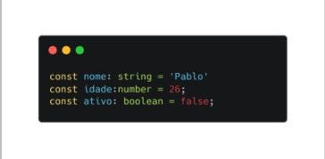
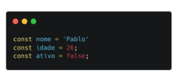
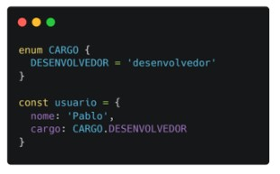
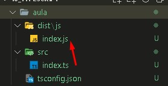

<br>

# TypeScript

Ele é um superset de javaScript, ou seja, um conjunto de ferramentas e formas mais eficientes de escrever código JS, adicionando recursos que não estão presentes de forma nativa na linguagem.

<br>

### Beneficios 
O TypeScript nos traz diversos beneficios,mas podemos destacar o potencial dedetecção de erros durante odesenvolvimento de projetos e apossibilidade de incluir a inteligência daIDE  que está sendo usada. Isso refletenum ambiente muito mais ágil e seguroenquanto o código está sendo digitadopelo usuário.

<br>

### Conceitos basicos do TS

1. Tipagem Estática:
    

        
        Deixa claro o que aquela váriavel está recebendo.


Como fica dentro do meu JS:


      
      Quando eu seto uma tipagem em uma váriavel, ele vai começar a entender que toda vez que eu usar aquela váriavel ela vai receber o tipo que eu passei mais cedo.


2. Interfaces


      Quando queremos tipar um objeto, ou seja, falar para ele o que aquele objeto vai receber. Como boa prática colocamos um "I" maiúsculo no nome da Interface.

3. enum



      Ele vem para centralizar nossas informações, reutilizando elas sem se preocupar a escrever errado.
      

## Converter Projetos JS para TS

Para criar um arquivo TypeScript colocamos seu final com  .ts ao inves de .js;

Para iniciar o o TypeScript usa-se:
**npx tsc --init**;
ou
**tsc --init**


Vai me criar um arquivo chamado de **tsconfig**, onde eu posso configurar o meu TypeScript;


Criando assim um arquivo chamado de tsconfig.js, que comtém todas as configurações do typeScript.

## Configuração básica

```JS
"target": "<Eu posso mudar a versão do meu typeScript por aqui>",
 "rootDir": "<aqui eu vou colocar o caminho da pasta do meu TypeScript, que no caso é: >""./src/", 
 "outDir": "<aqui é o caminho onde vai ficar meu JavaScipt conectado com meu TypeScript>""./dist/js/",
```

<br>

Se eu executar o comando **tsc** ele vai atualizar o meu TypeScript:



Eu posso fazer essa atualização de forma automatica, usando o comando **tsc -w**, assim, toda alteração que eu fizer no meu TypeScript ira ser passado para o meu JS que foi definido no tsconfig.json.


<br>

