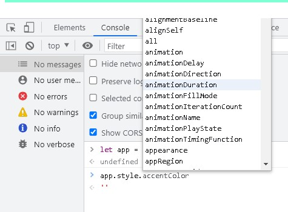
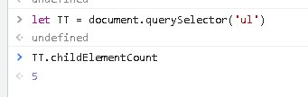

# DOM - Document object model

[Artigo](https://www.notion.so/Masterclass-DOM-48ef7efae2ad4e0c8f9b462b675d2b0d);

[Video](https://www.youtube.com/watch?v=UftSB4DaRU4).


-   Estrutura de árvore criada pelo browser para o Javascript
-   Representação do HTML em Objetos
-   Propriedades e métodos
-   Javascript usa a DOM para se conectar ao HTML
-   Manipular o HTML com o JavaScript

<br>

### document

Ele se refere ao documento;
se eu passar `document` apenas, ele vai me falar que estou me referindo ao documento inteiro.

como ele é um objeto eu posso usar `document.` e descobrir as propriedades que ele tem, exemplos:

 - document.location= me devolve o href;
 - document.URL = me retorna a URL da página;
 - document.head = me retorna os head do meu HTML.


## Buscando e selecionando elementos

- document.getElementById (returns element)
- document.getElementsByClassName (returns HTMLCollection)
- document.getElementsByTagName (return HTMLCollection)
- document.querySelector (returns element)
- document.querySelectorAll (returns NodeList)

Vamos trazer como exemplo essa imagem:
<br>

<br>

<br>

### **getElementById** 
Eu consigo capturar um elemento pelo Id dele dentro do HTML;
```Js
document.getElementById("meuid")
```


<br>

### **getElementsByClassName**
Buscar por nome da classe;
```Js
document.getElementsByClassName("minhaClasse")
```
OBS: ele me deu um HTMLCollection que retorna ambas as listas
<br>


<br>

### **getElementsByTagName**
Mesma coisa que o ClassName, mas dessa vez eu passo uma tag do HTML;
```Js
document.getElementsByTagName("div")
```

Ele me retorna uma Htmlcolection como todas as tags
<br>


<br>

### **querySelector**
Dentro do Selector eu posso colocar um seletor estilo CSS:
```JS
document.querySelector(".noMeuCSS")
document.querySelector("#teste")
```
Ele sempre me retorna o primeiro elemento que encontrar:
<br>
 
 <br>
 

<br>

### **querySelectorAll**
A diferença dele para o querySelector é que ele vai trazer todos os elementos que estão vinculados

retorna todos os elementos:
<br>

<br>


<br>

## Diferença entre querySelector e getElements
**querySelector**
Retorna apenas o primeiro elemento com as propriedades CSS inseridas como parâmetro e só pode ser utilizado no escopo do document;
Usado no CSS;
forma retorna uma NodeList a qual parece ser um array, mas não é, contudo é possível utilizar o foreach nessa coleção (dependendo da versão do navegador).

**getElements**
É uma função da classe object que seleciona todos os elementos contidos no objeto que está sendo utilizado como construtor. Ou seja retorna uma coleção de objetos;
Usado no HTML;
retorna uma HTML Collection, que embora represente uma coleção de elementos, ela também não é um array e diferente do primeiro caso, não têm o método foreach, porém, você pode chamar esse método através do prototype do Array.


<br><br>

## Manipulando conteúdo


### .textContent
Me mostra o conteúdo dentro do elmento:
<br>


<br>

### .innerText
Ele muda o conteúdo dentro do elemento:
<br>


<br>

### .innerHTML
Ele muda o elemento dentro do HTML:
<br>


<br><br>


## Alterando Estilos
### .style.property (camelCase)
Altera o estilo do meu elemento:
<br>

<br>


<br><br>

## Navegando pelos elementos

### Children
Se refere aos filhos do elemento:
<br>


<br>

#### childNodes
Se pega um NodeList
<br>


#### childElementCount
Conta a quantidade de filhos do elemento
<br>



#### .firstChild & .lastChild
PRimeiro filho e ultimo filho
<br>


#### remove()
remove o Elemento
<br>


<br><br>

### parent
se refere ao pai do elmento

#### paremtNode e parentElement
ambos funcionam do mesmo jeito
<br>


<br><br>


<br><br>

### Siblings 
Irmãos do elemento


#### nextElementSibling
Pega o próximo elemento
<br>


#### previousElementsSibling
<br>


<br><br>

## .createElement()
Criação de novos elementos.createElement("<aqui dentro se coloca a tag do item no HTML>")
<br>
<br>
Nesse caso o elemento está em memoria, mas como faço para inserir ele no meu HTML?

#### Inserindo elementos no HTML

##### **append()**
Significa que ele vai colocar o elemento sendo o último, filho, do elemento pai:
<br>
<br>
No caso a gente colocou o nosso paragrafo, sendo o ultimo elemento a aparecer no body.


##### **prepend()**
Ele coloca o elmento como o primeiro do elemento pai:
<br>


##### **.insertBefore(newNode, referenceNode) & .insertAfter(newNode, referenceNode)**
Coloque antes e coloque depois, de alguma coisa:


<br>
<br>


## Trabalhando com propriedades dos elementos

### getAtrribute()
Eu posso indicar qual atributo dele eu quero:

<br>


### setAtrribute()
Assim como eu posso pegar um Atributo, eu posso setar um novo:
<br>
<br>

### removeAttribute()
Também posso remover o atributo:

<br>
<br>


# **Eventos**
## addEventListener()
addEventListener() registra uma única espera de evento em um único alvo. 
Em outras palavra ele 'escuta' um evento:
```JS
alvo.addEventListener(type,function);
```
### load
O evento de load é acionado quando um recurso e seus recursos dependentes terminaram de carregar.

```JS
<script>
  window.addEventListener("load", function(event) {
    console.log("Todos os recursos terminaram o carregamento!");
  });
</script>
```

### click
Quando clique é usado com elementos que o suportam (por exemplo, um dos `<input>` tipos listados acima), ele também dispara evento de clique do elemento que vai propagar pelos elementos mais acima na árvore de documentos (ou cadeia do evento) e disparando seus eventos de clique também. No entanto, o evento de clique, propagado como bubble, não vai iniciar a navegação do elemento `<a>` como se uma verdadeiro clique do mouse tivesse sido recebido.
```JS
elt.click()
alvo.addEventListener("click",function);
```


### scroll
Rola a janela para uma posição específica no documento.
window.scroll(x-coord, y-coord)
x-coord é o pixel que você deseja exibir ao longo do eixo horizontal do documento em relação à sua extremidade superior esquerda.
y-coord é o pixel que você deseja exibir ao longo do eixo vertical do documento em relação à sua extremidade superior esquerda.
```JS
<button onClick="scroll(0, 100);">clique para rolar 100 pixels para baixo</button>
```
### keydown

O evento keydown é disparado quando uma tecla é pressionada.

 Diferente do evento keypress, o keydown é disparado para teclas que produzem e que não produzem um caractere.
 ```JS
 alvo.addEventListener("keydown",function);
 ```
### change

O evento change é usado quando um `<input>`,`<select>`e `<textarea>`elemento tem uma modificação em seu valor.

```JS
addEventListener('change', (event) => {});
```
### submit
O evento submit é disparado quando é feita a submissão de um `<form>`.
```JS
addEventListener('submit', (event) => {});
```
<br><br>

## event
Eventos Dom (Dom Events) são utilizados para notificar o código de novidades durante a navegação do usuário. Cada evento é representado por um objeto que é baseado na interface Event, e pode ter campos customizados adicionados e/ou funções usadas para obter informações adicionais sobre o que aconteceu. Eventos podem representar desde interações básicas do usuário (cliques, rolagem da página...) até notificações automáticas de novidades no DOM.
### target
Uma referência ao objeto que enviou o evento. 
A propriedade event.target pode ser usada para implementar a delegação de eventos.
```JS
// Assumindo que existe uma variável 'list' contendo uma instância de um elemento ul de HTML.
function hide(e) {
  // A menos que os itens da lista sejam separados por uma margem, e.target deve ser diferente de e.currentTarget
  e.target.style.visibility = 'hidden';
}

list.addEventListener('click', hide, false);

// Se algum elemento (elemento <li> ou um link dentro de um elemento <li> por exemplo) for clicado, ele desaparecerá.
// Só requer um único listener para fazer isso
```

## ClassName
É praticamente uma propriedade que permite ler qual a string que existe dentro do atributo classe.

Ele também permite altera-lá:
<br>
<br>

## ClassList
A principal vantagem do ClassList é poder maniuplar a minha classe do elemento, podendo adicionar novas classes, remover, toggle, contains, e etc...

<br>
<br>