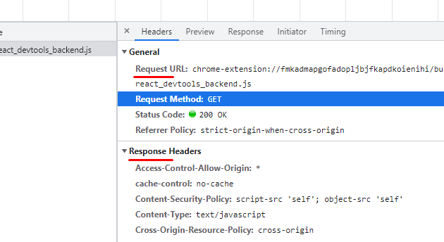
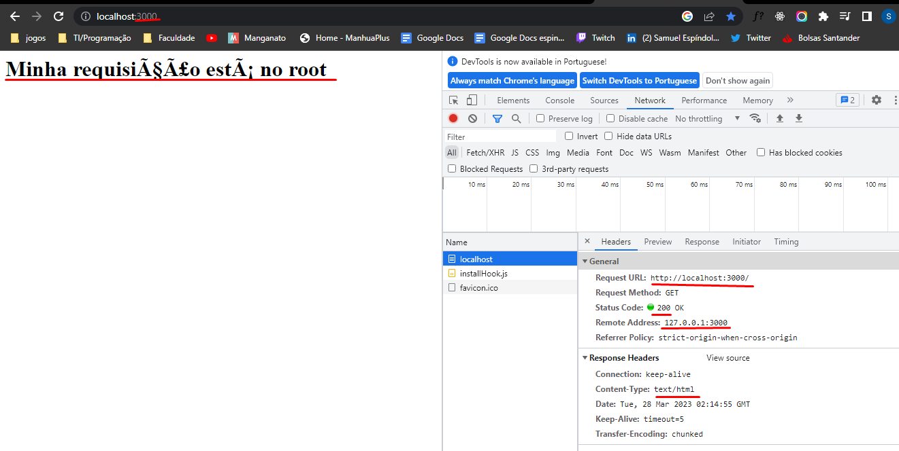
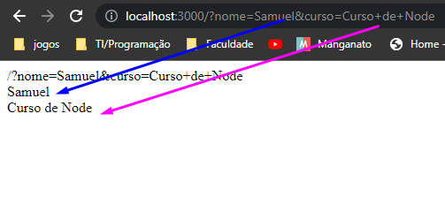
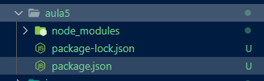

# Sumário:

- **[Node](#NodeJS):**
    - [Cats](#cat);
    - [CreateServer](#criando-um-servidor-simples-em-node);
    - [WriteHead](#reswriteheadstatuscode-statusmessage-headers);
    - [Parâmetros pela URL](#passando-parâmetros-pela-url);
    - [FS](#módulo-fs);
    - [Express](#criando-rotas-usando-express);
    - [Router](#modularizando-as-rotas-do-app-nodejs);
- **[Nodemon](#nodemon);**

# NodeJS

De acordo com sua definição oficial, o Node é um runtime, que nada mais é do que um conjunto de códigos, API's, ou seja, são bibliotecas responsáveis pelo tempo de execução (é o que faz o seu programa rodar) que funciona como um interpretador de JavaScript fora do ambiente do navegador web.

Um module system nos permite dividir e incluir linhas de código escritas em outros arquivos ou escrita por outrs dev's no momento que a gente necessitar.


# Cat

https://http.cat/

vamos usar esse site para entender o retorno de estados do meu http


# Criando um servidor simples em Node 

```JS
const http = require('http');
//Requerimento do http do node

http.createServer((request, response) => {
    response.writeHead(200, {
        "Content-Type" : "text/plain"
    });
    response.write('Servidor foi criado')
    response.end()
}).listen(1337)
```

## createServer

O http.createServer() é um método do módulo http do Node.js que é utilizado para criar um servidor HTTP. Ele recebe como parâmetro uma função de callback que será executada para cada requisição HTTP recebida pelo servidor.


```JS
const http = require('http');

http.createServer((req, res) => {
  // Tratamento da requisição HTTP
}).listen(porta);
```

req: Objeto representando a requisição HTTP recebida pelo servidor.
res: Objeto representando a resposta HTTP a ser enviada pelo servidor.
porta: Número da porta em que o servidor deve escutar as requisições HTTP.

Dentro da função de callback passada como parâmetro para o método http.createServer(), é possível realizar o tratamento da requisição HTTP e enviar a resposta apropriada utilizando o objeto res.

```JS
const http = require('http');

http.createServer((req, res) => {
  res.writeHead(200, {'Content-Type': 'text/plain'});
  res.write('Hello, world!');
  res.end();
}).listen(3000);

console.log('Servidor rodando na porta 3000.');

```

Nesse exemplo, o servidor HTTP é criado utilizando o método http.createServer(), que recebe como parâmetro uma função de callback. Dentro da função de callback, é utilizado o objeto res para enviar uma resposta com status 200 e tipo de conteúdo text/plain. 
Em seguida, é escrito o conteúdo 'Hello, world!' na resposta e finalmente a conexão é encerrada utilizando o método res.end(). O servidor é configurado para escutar na porta 3000. Quando o servidor é iniciado, a mensagem 'Servidor rodando na porta 3000.' é exibida no console.



## res.writeHead(statusCode[, statusMessage][, headers])


Como o próprio nome diz, ele vai escrever no cabeçalho da nossa requisição. Lembra quando estudamos o HTTP? O Status code indica o status da nossa requisição.

statusCode: Código de status HTTP a ser enviado na resposta. Pode ser um número ou uma string.
statusMessage (opcional): Mensagem de status HTTP a ser enviada na resposta. Por padrão, é usada a mensagem correspondente ao código de status.
headers (opcional): Um objeto contendo os cabeçalhos HTTP a serem enviados na resposta.

 ## Write

 Literalmente vai escrever no meu arquivo

 ## end

 finaliza meu response process.

 É usado para finalizar meu response sem nenhum dado.

 ## listen

 Indica o acesso do meu servidor.
 Como parâmetro ele tem a porta o hostname e um backlog(retorna algo quando meu servidor é inicializado)
 **http://localhost:1337/**


# Mais detalhado:

```JS
const http = require('http');

const porta = 3000
const host = '127.0.0.1'//localhost = é o ip de callback(127.0.0.x)

const server = http.createServer((req, res) => {
    res.writeHead(200, {
        "Content-Type" : "text/html"
    })
    if (req.url == '/') {
        res.write('<h1>Minha requisição está no root</h1>')
    }else if (req.url == "/canal"){
        res.write('<h1>Canal</h1>')
    }else if (req.url == "/curso"){
        res.write('<h1>Cursos</h1>')
    }
    res.end()
})

server.listen(porta, host, () => console.log('Essa é minha função de backlog, que é chamada quando meu servidor é ativo'))
```



```JS
if (req.url == '/') {
        res.write('<h1>Minha requisição está no root</h1>')
    }else if (req.url == "/canal"){
        res.write('<h1>Canal</h1>')
    }else if (req.url == "/curso"){
        res.write('<h1>Cursos</h1>')
    }
```

**http://localhost:3000/** : req.url == '/'
**http://localhost:3000/canal** : req.url == '/canal'
**http://localhost:3000/curso** : req.url == '/curso'


# Passando parâmetros pela URL:

```JS
const http = require('http');

const porta = 3000
const host = '127.0.0.1'
const url = require('url')


const server = http.createServer((req, res) => {
    res.writeHead(200, {
        "Content-Type" : "text/html"
    })
    res.write(req.url)

    const p = url.parse(req.url, true).query;
    
    res.write('<br/>' + p.nome)
    res.write('<br/>' + p.curso)
    res.end()
})

server.listen(porta, host)
```



A função url.parse() é usada para analisar uma URL e retorna um objeto com as diferentes partes da URL (como o protocolo, o host, o caminho, entre outros).

Nesse caso, o segundo parâmetro true indica que o método deve analisar a query string da URL (os parâmetros passados após o "?") e retornar um objeto com esses parâmetros.

Portanto, a linha de código retorna um objeto com os parâmetros da query string da URL da requisição.


# Módulo FS

Em Node.js, o módulo fs (abreviação de "file system") é utilizado para interagir com o sistema de arquivos do computador. 
Ele fornece uma API para realizar operações de leitura, gravação e manipulação de arquivos e diretórios.

Algumas das funcionalidades disponíveis no módulo fs incluem:

- Ler e escrever arquivos de texto
- Ler e escrever arquivos binários
- Criar e remover arquivos e diretórios
- Renomear e mover arquivos e diretórios
- Obter informações sobre arquivos e diretórios (como tamanho, data de modificação, permissões, etc.)

O fs é um dos módulos principais do Node.js e é utilizado em muitas aplicações para lidar com a persistência de dados em disco. 
Ele é acessível utilizando a sintaxe require('fs').


## fs.appendFile(file, data[, options], callback)
 
file: O caminho do arquivo a ser modificado.
data: Os dados a serem acrescentados ao arquivo.
options: Um objeto opcional que pode conter opções como encoding, mode e flag.
callback: Uma função opcional a ser chamada quando a operação de escrita for concluída


Ao utilizar o método fs.appendFile(), os dados são adicionados ao final do arquivo existente, mantendo o conteúdo original. 
Se o arquivo não existir, o método irá criar um novo arquivo e escrever os dados informados.

```JS
const fs = require('fs');

fs.appendFile('file.txt', 'Novos dados a serem adicionados', (err) => {
  if (err) throw err;
  console.log('Dados adicionados ao arquivo com sucesso!');
});

```

Nesse exemplo, os dados 'Novos dados a serem adicionados' serão acrescentados ao final do arquivo file.txt. 
Se o arquivo não existir, ele será criado e os dados serão escritos. 
O método console.log() será chamado se a operação de escrita for concluída com sucesso.

```JS
const http = require('http');
const fs = require('fs');


const server = http.createServer((req, res)=> {
    fs.appendFile('teste.txt',"Esse vai ser o dado que ira ser inserido no final do meu arquivo",(err) =>{
        if(err) throw err
        console.log("Meu arquivo estás funcionando");
        res.end()
    })
})

server.listen(3000, () => {console.log("Servidor rodando")})
```
Como eu não tenho um arquivo chamado teste.txt antes de rodar o servidor, ele vai criar para mim;

O segundo parâmetro é os dados que vão ser usados dentro do meu arquivo;

Toda fez que eu der f5 na minha página do servidor ele vai me devovler a menssagem **"Meu arquivo estás funcionando"** no console, e também toda vez que eu der f5 ele vai adicionar mais um append ao meu arquivo com a mensagem de dados.


## fs.readFile(caminhoArquivo, [opcoes], callback);

Onde:

caminhoArquivo: O caminho do arquivo a ser lido.
opcoes: Um objeto opcional que pode conter opções como encoding e flag.
callback: Uma função de retorno que será chamada quando o conteúdo do arquivo for lido. 
A função recebe dois argumentos: um erro, caso ocorra algum problema durante a leitura do arquivo, e os dados lidos do arquivo, caso a leitura seja bem-sucedida.

```JS
const fs = require('fs');

fs.readFile('arquivo.txt', (err, data) => {
  if (err) throw err;
  console.log(data);
});

```

Nesse exemplo, o método fs.readFile() é utilizado para ler o conteúdo do arquivo arquivo.txt. Quando a operação de leitura for concluída, a função de callback passada como parâmetro será chamada. Se ocorrer algum erro durante a leitura do arquivo, o erro será armazenado na variável err. Caso contrário, os dados lidos do arquivo serão armazenados na variável data.

É importante destacar que o método fs.readFile() realiza a leitura de forma assíncrona, ou seja, a operação de leitura é executada em segundo plano, enquanto o programa continua a executar outras tarefas. 
Quando a leitura for concluída, a função de callback será chamada. 
Caso seja necessário realizar a leitura de forma síncrona, ou seja, aguardando a conclusão da operação antes de continuar a execução do programa, é possível utilizar o método fs.readFileSync().


Vamos pegar o nosso exemplo:

```JS
const http = require('http');
const fs = require('fs');

const server = http.createServer((req, res)=> {
    fs.readFile('index4.html',(err, arquivo) =>{
        res.writeHead(200, {
            "Content-Type": "text/html"
        })
        res.write(arquivo)
        return res.end()
    })
})

server.listen(3000, () => {console.log("Servidor rodando")})
```
readFile vai ler o meu arquivo no path **index4.html**, e em seguida ele vai pegar aa minha função de callback que recebe um erro, e o arquivo que eu peguei.

Em seguida, vamos criar o cabeçalho do nosso servidor.

Logo apos será escrito no nosso servidor o arquivo lido, que no caso é um arquivo html.


# Criando Rotas usando Express

Primeiro vamos criar um instalar o express em uma pasta(aula5): `npm i express --save`




O Express é um framework para Node.js que simplifica o processo de criação de aplicativos web. Ele fornece um conjunto de recursos que facilitam o roteamento de solicitações HTTP, o gerenciamento de sessões, a renderização de templates e outras tarefas comuns na criação de aplicativos web.

Com o Express, é possível criar rotas para diferentes URLs, definir manipuladores de solicitação para essas rotas e fornecer respostas personalizadas para os clientes. Além disso, o Express também possui um mecanismo de middleware que permite adicionar funções intermediárias para manipular solicitações e respostas HTTP antes que elas sejam enviadas para o cliente.

O Express é amplamente utilizado pela comunidade Node.js e possui uma documentação extensa e recursos de comunidade significativos. Ele é altamente configurável e pode ser estendido através de pacotes de terceiros para incluir recursos adicionais, como autenticação de usuário, compressão de resposta, suporte a WebSocket, entre outros.

Para utilizar o Express em um projeto Node.js, é necessário instalá-lo através do gerenciador de pacotes npm. Uma vez instalado, o Express pode ser importado em um arquivo JavaScript com o seguinte código:

```JS
const express = require('express');
const app = express();
```

A partir daí, é possível definir rotas e manipuladores de solicitação, adicionar middleware e iniciar o servidor.

```JS
const express = require('express');
const app = express()
const porta = process.env.PORT

app.get('/',(req, res)=> {
    res.send('Aqui eu vou mandar a resposta')
})

app.get('/canal', (req, res) =>{
    res.json({canal : 'Seja Bem Vindo'})//me retorna um json na rota /canal
})

app.listen(porta || 3000, () => console.log('servidor rodando'))
```

**app**: vai ser responsavel por receber minha Express aplication
**get**: vai criar uma rota
**send**: Vai ser usado para mandar o conteúdo para o meu app

Viu como fica mais fácil usando o Express!?


# Modularizando as rotas do App Node.JS


Primeiro vamos instalar o express e o router:`npm i express --save`& `npm i router --save`


O Router é uma função do Express que permite criar um objeto de roteador modular que pode ser usado para gerenciar rotas e manipuladores de solicitação para uma parte específica da aplicação.

O Router pode ser usado para separar a lógica de roteamento em arquivos separados ou para organizar o código em uma aplicação maior com várias seções.

Ele fornece uma forma de criar grupos de rotas que podem ser montadas em diferentes caminhos da URL.

Para utilizar o Router, é necessário criar um objeto de roteador usando a função ``express.Router()``

Em seguida, é possível definir rotas e manipuladores de solicitação no objeto do roteador da mesma forma que se faz com o objeto de aplicativo Express.

```JS

const express = require('express');
const app = express();

const router = express.Router();

// Define uma rota no objeto de roteador
router.get('/', (req, res) => {
  res.send('Olá do roteador!');
});

// Monta o objeto de roteador no caminho /api
app.use('/api', router);

// Inicia o servidor
app.listen(3000, () => {
  console.log('Servidor iniciado na porta 3000');
});

```

Nesse exemplo, o objeto de roteador é criado usando a função express.Router();

Em seguida, é definida uma rota no objeto de roteador usando o método get();

Esse método recebe uma URL e uma função de manipulador de solicitação que é executada quando a rota é acessada.

Finalmente, o objeto de roteador é montado no aplicativo Express usando o método use(). Isso permite que o roteador seja acessado através do caminho /api.


# Explicando o código feito:

Vamos começar explicando o que acontece no arquivo rotas.js:

```JS
const express = require('express');
const app = express();
const rotas = express.Router();
//Até aqui eu apenas importo as minhas dependências

let cursosInfo = [
    {'curso' : 'node', "info": "Curso de node"},
    {'curso' : 'Java', "info": "Curso de Java"},
    {'curso' : 'PHP', "info": "Curso de PHP"},
    {'curso' : 'Arduino', "info": "Curso de Arduino"}
]
//Aqui é feito o meu "JSON" fake


rotas.get('/', (req, res)=>{
    res.json({ola : "ola para o meu texto"})
})
//Quando eu estiver no meu root vai me dar na tela essa msg de json


rotas.get('/:cursoid', (req, res)=>{//Quando eu coloco /: eu sou obrigado a passar um parâmetro, se não ele me da um erro
    const curso = req.params.cursoid
    const cursoI = cursosInfo.find( i => i.curso == curso)
    if (!cursoI) {
        res.status(404).json({err: "Curso não encontrado", cursoPesquisa : curso})//404 -> not found
    }else{
        res.status(200).json(cursoI)
    }
})


module.exports = rotas
//Exportando o que é feito no *rotas* para o outro arquivo
```

**const curso = req.params.cursoid**: 
é uma propriedade do objeto **req.params** do framework Node.js que contém o valor do parâmetro **cursoid** passado na URL da requisição. 
No código fornecido, essa propriedade é usada para buscar o objeto cursoI que possui informações sobre o curso especificado na URL.

**const cursoI = cursosInfo.find( i => i.curso == curso)**: 
Essa linha de código usa o método find para buscar no array **cursosInfo** um objeto cuja propriedade curso tenha o mesmo valor da variável **curso**.
O método find é usado para retornar o primeiro elemento do array que atende à condição especificada em uma função callback. 
No caso desse código, a função callback é **(i => i.curso == curso)**, que verifica se a propriedade curso de um objeto **i** é igual à variável curso.
Se um objeto com essa propriedade for encontrado, ele é atribuído à constante **cursoI**. Se não for encontrado, o valor de **cursoI** será undefined.

Agora vamos para nosso arquivo index.js:

```JS
const express = require('express');
const rotas = require('./rotas/rotas')
const app = express()

app.use('/', rotas)//lembrando que rotas foram importados do meu outro arquivo

app.get('*', (req, res) => {
  res.send('CBF Cursos')
})

app.listen(3000, () => console.log('rodando'))
```

a função **app.use()** é usada para definir uma rota que deve ser correspondida para determinado conjunto de requisições HTTP.

O primeiro parâmetro da função é a rota a ser correspondida, e o segundo parâmetro é a função (ou conjunto de funções) que deve ser executada quando a rota é correspondida.

É importante destacar que o **'*'** usado como rota corresponderá a qualquer requisição do método GET que não tenha sido definida explicitamente na aplicação, o que pode não ser desejado em todos os casos.

# nodemon

`npm i nodemon -g`

Ao inves de executar como o node eu vou executar com o nodemon, e toda vez que eu alterar meu arquivo ele vai salvar e rodar o servidor para mim


