- **[MySQL](#mysql);**
    - [Logar](#como-logar);
    - [BD](#mostrar-banco-de-dados);
    - [Criar BD](#criar-um-banco-de-dados);
    - [Acessar BD](#acessar-o-bando-de-dados);
    - **Tabelas:**
        - [Criar Tabela](#criar-tabelas);
        - [Ver Dentro da Tabela](#ver-dentro-da-tabela);
        - [manipular SQL](#manipulando-o-mysql);
        - [Ver dados dentro da Tabela](#ver-todos-os-dados-da-tabela);
    - **[Instruções SQL](#conjunto-de-instruções-sql):**
        - [DDL](#linguagem-de-definição-de-dados-ddl-do-inglês-data-definition-language);
        - [DML](#linguagem-de-manipulação-dos-dados-dml-do-inglês-data-manipulation-language);
        - [DQL](#linguagem-de-consulta-a-dados-dql-do-inglês-data-query-language);
        - [DCL](#linguagem-de-controle-de-dados-dcl-do-inglês-data-control-language);
        - [DTL](#linguagem-de-transação-de-dados-dtl-do-inglês-data-transaction-language);
    - [DISTINCT](#tirar-duplicatas);
    - [Arritmética](#aritimética);
    - [Clausula WHERE](#lógica-e-condicional);
    - [Ambiguidade](#ambiguidade);
    - [Like & Order By](#operações-de-stringlike-e-ordenaçãoorder-by);
    - [Update](#update):


# mySQL

Acredito que o mySQL dispensa apresentações, então vamos direto para ele.


## Conjunto de instruções SQL

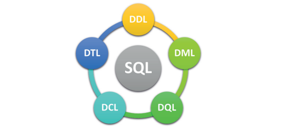

## Linguagem de Definição de Dados (DDL, do inglês Data Definition Language)


Conjunto de instruções SQL para definição dos dados e sua estrutura.

**CREATE** – cria banco de dados, tabelas, colunas.

**DROP** – exclui banco de dados, tabelas, colunas.

**ALTER** – altera banco de dados, tabelas, colunas.

**TRUNCATE** – esvazia toda a tabela.


## Linguagem de Manipulação dos Dados (DML, do inglês Data Manipulation Language)

Conjunto de instruções SQL para inserção e manutenção dos dados.

**INSERT** – insere dados em uma tabela.

**UPDATE** – atualiza os dados existentes em uma tabela.

**DELETE** – exclui registros de uma tabela.

## Linguagem de Consulta a Dados (DQL, do inglês Data Query Language)

Conjunto de instruções SQL para consulta de todos os dados armazenados e suas relações, e ajuda para comandos de sintaxe.

**SELECT** – principal instrução de consulta do SQL:
 
 - **FROM**:  lista as tabelas que deverão ser lidas;
 
 - **WHERE** – consiste em expressões lógicas envolvendo os campos das tabelas da cláusula FROM.

**SHOW** – exibe todas as informações além dos dados (metadata).

**HELP** – exibe informações do manual de referência do MySQL.


## Linguagem de Controle de Dados (DCL, do inglês Data Control Language)

Conjunto de instruções SQL para controle de autorizações de
acesso e seus níveis de segurança.

**GRANT** – essa instrução concede privilégios às contas de usuário.

**REVOKE** – essa instrução permite revogar os privilégios da conta de usuário.

## Linguagem de Transação de Dados (DTL, do inglês Data Transaction Language)

Conjunto de instruções para o controle de transações lógicas que são agrupadas e executadas pela DML.

**START TRANSACTION** – inicia uma nova transação.

**SAVEPOINT** – identifica um determinado ponto em uma transação.

**COMMIT** – é uma instrução de entrega ao SGBD, fazendo com
que todas as alterações sejam permanentes.

**ROLLBACK [TO SAVEPOINT]** – é uma instrução ao SGBD para
reverter toda a transação, cancelando todas as alterações ou até
determinado ponto da transação.

**RELEASE SAVEPOINT** – instrução para remoção de um SAVEPOINT.


## como logar?

eu posso abrir o cmd e escrever isso aqui:

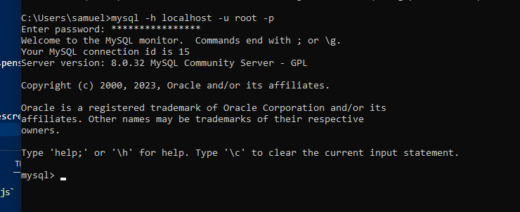

-h : em qual servidor eu quero conectar, no caso o localhost

-u : root que é o user padrão

Ou eu posso simplesmente abrir direto no Mysql 8.0 Command Line Client

## mostrar banco de dados

**show databases;**

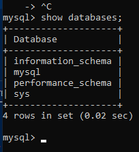

## criar um banco de dados 

**create database _nomeDoBanco_;**

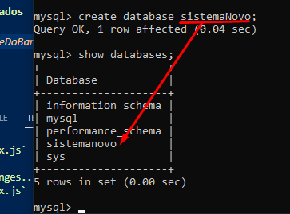

## acessar o bando de dados

**use _nomeDoBanco_**

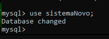

## Dados

Uma tabela pode ter vários tipos diferentes de dados, sendo os principais deles:

- Int;
- Char;
- Date;
- Float;
- Blob.

## Como mostrar as tabelas dendo do BD

**show tables;**
No caso não temos a tabela ainda, mas temos o banco de dados.


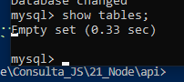
 

## Criar tabelas

Para gerenciar a minha tabela a gente precisa usar um leitor de texto, exemplo o vscode.

Primeiro precisamos criar um arquivo com o final **.sql**

vamos criar nossa tabela:

```SQL
CREATE TABLE usuarios(//CREATE TABLE _nomeDaTabela_
    nome VARCHAR(30),//no máximo 30 caracteres
    idade INT,//Tipo inteiro
    email VARCHAR(50)//no máximo 50 caracteres
);
```

Vamos copiar isso e jogar dentro do nosso prompt do sql:

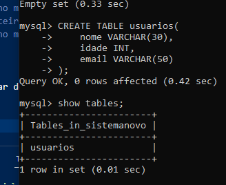

## Ver dentro da tabela:

**describe _nomeDaTabela_**

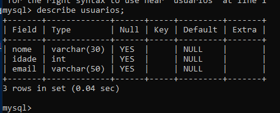

## Manipulando o MySQL:

para inserir dados eu vou usar o comando **insert into _nomeDaTabela_(_todosOsCamposQueQuerinserir_) Values(_ValoresParaCadaCampo_);**

```SQL
INSERT INTO usuarios(nome, idade, email) VALUES(
    "Samuel Espíndola",
    21,
    "teste@gmail.com"
);
```

Lembrando que esse comando vai direto no prompt do MySQL.

## Ver todos os dados da tabela

**SELECT _NomeDoCampoOu*_ FROM _nomeDaTabela_;**

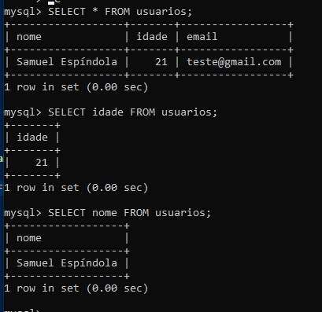

Logicamente eu posso inserir várias linhas distintas:

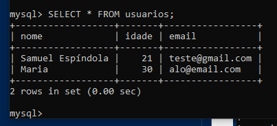

## Especificar consulta

**SELECT _NomeDoCampoOu*_ FROM _nomeDaTabela_ WHERE condição;**

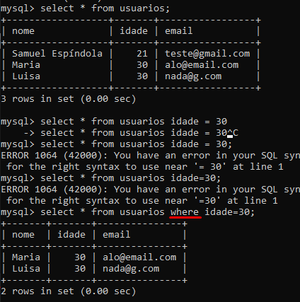


## Tirar Duplicatas:

É possível que contenha duplicatas na minha tabela, eu posso retira-las usando o DISTINCT:

**SELECT DISTINCT idade FROM usuarios;**

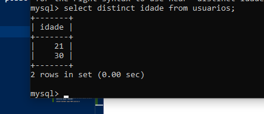

## Aritimética:

Eu posso fazer modificações aritiméticas no meu select:

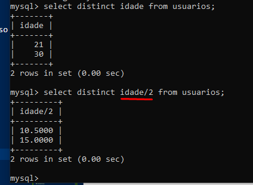


## Lógica e condicional:

Eu posso usar junto com o meu WHERE outras clásulas lógicas e condicionais:

**AND, OR, NOT, BETWEEN, >, < , <>, >=, <=, =**

Acredito que pelo nosso conhecimento não preciso explicar cada uma delas.

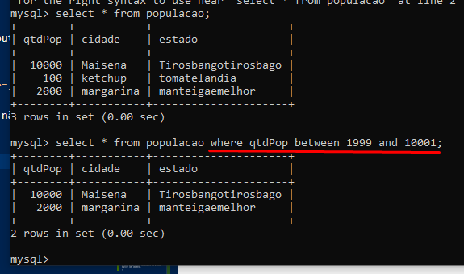

## Ambiguidade:

imagine que eu tenho 2 tabelas que tem campos identicos, ou seja, o campo tem o mesmo nome.

Para evitar ambiguidades podemos usar a sintaxe:

**SELECT NomeDaTabela.nome-da-coluna from nome_das_tabelas**

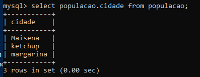

## Alias:

alias = como , a gente pode dizer assim:

**... populacao as pp;**

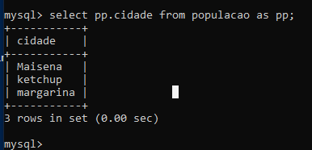


## operações de String(LIKE) e Ordenação(ORDER BY):

O operador LIKE determina a correspondência de padrões, que são descritos usando caracteres especiais:

- Porcentagem (%): corresponde a qualquer substring.

- Sublinhado (_): corresponde a qualquer caractere.

Para ilustrar, considere os seguintes exemplos:

- ‘Sor%’ localizará qualquer string iniciando com “Sor”.


- ‘%or%’ localizará qualquer string iniciando contendo “or”.

- ‘___’ localizará qualquer string com exatamente três caracteres.

- ‘___%’ localizará qualquer string com pelo menos três caracteres.


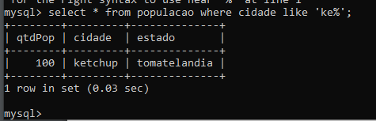


Outra cláusula importante é a ORDER BY, que controla os registros em relação à sua ordenação pelo campo especificado.

Essa cláusula ordena de forma crescente, por padrão, mas você pode explicitar essa ordem utilizando ASC ou, 
ainda, ordenar de maneira decrescente, com DESC. 

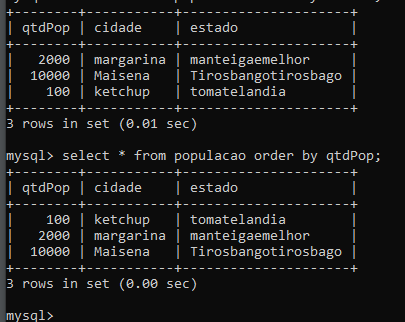

## DELETE:

**DELETE FROM tabela** --> Vai deletar toda a minha tabela,

Por isso é importante usar o WHERE junto:

**DELETE FROM tabela WHERE condição**


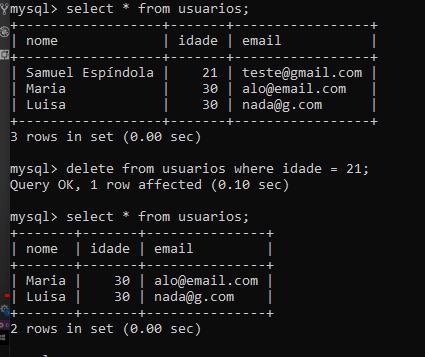

## update:

Atualizar algum dado da minha tabela:
 
**UPDATE NomeDaTabela SET NomeDoCampo = "ResultadoDoMeuUpdate"** --> todos os registros vão set atualizados,
então a gente usa where para um Especifico:
**UPDATE NomeDaTabela SET NomeDoCampo = "ResultadoDoMeuUpdate" WHERE condição**


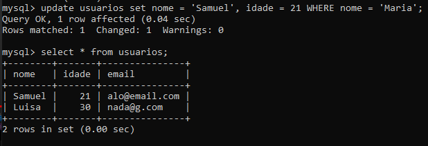