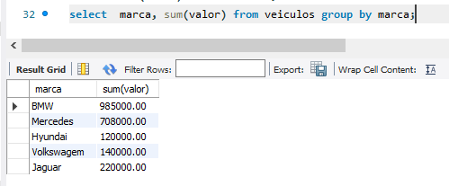

- **[MySQL](#mysql);**
    - [Logar](#como-logar);
    - [BD](#mostrar-banco-de-dados);
    - [Criar BD](#criar-um-banco-de-dados);
    - [Acessar BD](#acessar-o-bando-de-dados);
    - **Tabelas:**
        - [Criar Tabela](#criar-tabelas);
        - [Ver Dentro da Tabela](#ver-dentro-da-tabela);
        - [manipular SQL](#manipulando-o-mysql);
        - [Ver dados dentro da Tabela](#ver-todos-os-dados-da-tabela);
    - **[Instruções SQL](#conjunto-de-instruções-sql):**
        - [DDL](#linguagem-de-definição-de-dados-ddl-do-inglês-data-definition-language);
        - [DML](#linguagem-de-manipulação-dos-dados-dml-do-inglês-data-manipulation-language);
        - [DQL](#linguagem-de-consulta-a-dados-dql-do-inglês-data-query-language);
        - [DCL](#linguagem-de-controle-de-dados-dcl-do-inglês-data-control-language);
        - [DTL](#linguagem-de-transação-de-dados-dtl-do-inglês-data-transaction-language);
    - [DISTINCT](#tirar-duplicatas);
    - [Arritmética](#aritimética);
    - [Clausula WHERE](#lógica-e-condicional);
    - [Ambiguidade](#ambiguidade);
    - [Like & Order By](#operações-de-stringlike-e-ordenaçãoorder-by);
    - [Update](#update):
    - [Planejar um banco de dados](#planejar-um-banco-de-dados);
    - [Alterar a Tabela](#alterar-tabela);
    - [JOIN](#juncao-de-tabelas):
        - [INNER JOIN](#inner-join);
        - [LEFT JOIN](#left-join);
        - [RIGHT JOIN](#right-join);
    - [Funções de agregação](#funcoes-de-agregacao):
        - [COUNT](#count);
        - [MINIMO](#minimum);
        - [MAXIMO](#maximum-max);
        - [AVG](#average-avg);
        - [Soma](#total-sum);

        


# mySQL

Acredito que o mySQL dispensa apresentações, então vamos direto para ele.


## Conjunto de instruções SQL


## Linguagem de Definição de Dados (DDL, do inglês Data Definition Language)


Conjunto de instruções SQL para definição dos dados e sua estrutura.

**CREATE** – cria banco de dados, tabelas, colunas.

**DROP** – exclui banco de dados, tabelas, colunas.

**ALTER** – altera banco de dados, tabelas, colunas.

**TRUNCATE** – esvazia toda a tabela.


## Linguagem de Manipulação dos Dados (DML, do inglês Data Manipulation Language)

Conjunto de instruções SQL para inserção e manutenção dos dados.

**INSERT** – insere dados em uma tabela.

**UPDATE** – atualiza os dados existentes em uma tabela.

**DELETE** – exclui registros de uma tabela.

## Linguagem de Consulta a Dados (DQL, do inglês Data Query Language)

Conjunto de instruções SQL para consulta de todos os dados armazenados e suas relações, e ajuda para comandos de sintaxe.

**SELECT** – principal instrução de consulta do SQL:
 
 - **FROM**:  lista as tabelas que deverão ser lidas;
 
 - **WHERE** – consiste em expressões lógicas envolvendo os campos das tabelas da cláusula FROM.

**SHOW** – exibe todas as informações além dos dados (metadata).

**HELP** – exibe informações do manual de referência do MySQL.


## Linguagem de Controle de Dados (DCL, do inglês Data Control Language)

Conjunto de instruções SQL para controle de autorizações de
acesso e seus níveis de segurança.

**GRANT** – essa instrução concede privilégios às contas de usuário.

**REVOKE** – essa instrução permite revogar os privilégios da conta de usuário.

## Linguagem de Transação de Dados (DTL, do inglês Data Transaction Language)

Conjunto de instruções para o controle de transações lógicas que são agrupadas e executadas pela DML.

**START TRANSACTION** – inicia uma nova transação.

**SAVEPOINT** – identifica um determinado ponto em uma transação.

**COMMIT** – é uma instrução de entrega ao SGBD, fazendo com
que todas as alterações sejam permanentes.

**ROLLBACK [TO SAVEPOINT]** – é uma instrução ao SGBD para
reverter toda a transação, cancelando todas as alterações ou até
determinado ponto da transação.

**RELEASE SAVEPOINT** – instrução para remoção de um SAVEPOINT.


## como logar?

eu posso abrir o cmd e escrever isso aqui:


-h : em qual servidor eu quero conectar, no caso o localhost

-u : root que é o user padrão

Ou eu posso simplesmente abrir direto no Mysql 8.0 Command Line Client

## mostrar banco de dados

**show databases;**


## criar um banco de dados 

**create database _nomeDoBanco_;**


## acessar o bando de dados

**use _nomeDoBanco_**


## Dados

Uma tabela pode ter vários tipos diferentes de dados, sendo os principais deles:

- Int;
- Char;
- Date;
- Float;
- Blob.

## Como mostrar as tabelas dendo do BD

**show tables;**
No caso não temos a tabela ainda, mas temos o banco de dados.


 

## Criar tabelas

Para gerenciar a minha tabela a gente precisa usar um leitor de texto, exemplo o vscode.

Primeiro precisamos criar um arquivo com o final **.sql**

vamos criar nossa tabela:

```SQL
CREATE TABLE usuarios(//CREATE TABLE _nomeDaTabela_
    nome VARCHAR(30),//no máximo 30 caracteres
    idade INT,//Tipo inteiro
    email VARCHAR(50)//no máximo 50 caracteres
);
```

Vamos copiar isso e jogar dentro do nosso prompt do sql:


## Ver dentro da tabela:

**describe _nomeDaTabela_**


## Manipulando o MySQL:

para inserir dados eu vou usar o comando **insert into _nomeDaTabela_(_todosOsCamposQueQuerinserir_) Values(_ValoresParaCadaCampo_);**

```SQL
INSERT INTO usuarios(nome, idade, email) VALUES(
    "Samuel Espíndola",
    21,
    "teste@gmail.com"
);
```

Lembrando que esse comando vai direto no prompt do MySQL.

## Ver todos os dados da tabela

**SELECT _NomeDoCampoOu*_ FROM _nomeDaTabela_;**


Logicamente eu posso inserir várias linhas distintas:


## Especificar consulta

**SELECT _NomeDoCampoOu*_ FROM _nomeDaTabela_ WHERE condição;**


## Tirar Duplicatas:

É possível que contenha duplicatas na minha tabela, eu posso retira-las usando o DISTINCT:

**SELECT DISTINCT idade FROM usuarios;**


## Aritimética:

Eu posso fazer modificações aritiméticas no meu select:


## Lógica e condicional:

Eu posso usar junto com o meu WHERE outras clásulas lógicas e condicionais:

**AND, OR, NOT, BETWEEN, >, < , <>, >=, <=, =**

Acredito que pelo nosso conhecimento não preciso explicar cada uma delas.


## Ambiguidade:

imagine que eu tenho 2 tabelas que tem campos identicos, ou seja, o campo tem o mesmo nome.

Para evitar ambiguidades podemos usar a sintaxe:

**SELECT NomeDaTabela.nome-da-coluna from nome_das_tabelas**


## Alias:

alias = como , a gente pode dizer assim:

**... populacao as pp;**


## operações de String(LIKE) e Ordenação(ORDER BY):

O operador LIKE determina a correspondência de padrões, que são descritos usando caracteres especiais:

- Porcentagem (%): corresponde a qualquer substring.

- Sublinhado (_): corresponde a qualquer caractere.

Para ilustrar, considere os seguintes exemplos:

- ‘Sor%’ localizará qualquer string iniciando com “Sor”.


- ‘%or%’ localizará qualquer string iniciando contendo “or”.

- ‘___’ localizará qualquer string com exatamente três caracteres.

- ‘___%’ localizará qualquer string com pelo menos três caracteres.


Outra cláusula importante é a ORDER BY, que controla os registros em relação à sua ordenação pelo campo especificado.

Essa cláusula ordena de forma crescente, por padrão, mas você pode explicitar essa ordem utilizando ASC ou, 
ainda, ordenar de maneira decrescente, com DESC. 


## DELETE:

**DELETE FROM tabela** --> Vai deletar toda a minha tabela,

Por isso é importante usar o WHERE junto:

**DELETE FROM tabela WHERE condição**


## update:

Atualizar algum dado da minha tabela:
 
**UPDATE NomeDaTabela SET NomeDoCampo = "ResultadoDoMeuUpdate"** --> todos os registros vão set atualizados,
então a gente usa where para um Especifico:
**UPDATE NomeDaTabela SET NomeDoCampo = "ResultadoDoMeuUpdate" WHERE condição**


# Planejar um banco de dados:

Para planejar um banco de dados, entendemos que há cinco
passos principais (MACHADO, 2014):
1. Coletar informações.
2. Identificar suas principais estruturas.
3. Modelar a estrutura.
4. Identificar nas estruturas os tipos de dados.
5. Identificar quais são seus relacionamentos.


 **Coletar informações** – Deve-se ter um entendimento do
trabalho a que o seu banco de dados se destina. Ele deverá
fornecer todas as informações necessárias para alcançar seu
objetivo. É importante entender qual a abrangência de seu
uso e o público-alvo, pois muitas informações deverão ser
úteis àqueles que no futuro utilizarão seu banco de dados.
Também é necessário identificar limitações e problemas, para
que, na definição de sua estrutura, você possa ultrapassá-las.


**Identificar suas principais estruturas** – Identificar suas
principais entidades, ou seja, suas tabelas, pois elas serão
gerenciadas pelo banco de dados. Essas tabelas representarão
algo tangível ou intangível, e isso quer dizer que podemos
representar pessoas, locais, clientes, cidades, bem como uma
venda, uma reclamação, uma autorização de compra, um
período de pagamentos de impostos, entre outras coisas.


**Modelar a estrutura** – A parte da modelagem de estrutura
pressupõe que as principais tabelas estejam identificadas,
então faz-se necessário gerar uma documentação, que é o
Diagrama Entidade-Relacionamento (DER) (HEUSER, 2009).
Neste momento, você pode utilizar alguns softwares para
esse desenho ou simplesmente utilizar papel e lápis. Mas
lembre-se sempre que, por se tratar de um registro intelectual
de sua criação, esse documento servirá para que outras
pessoas entendam o que você idealizou como modelo de
abstração para a resolução de um problema, e por isso ele
sempre deverá estar atualizado.


**Identificar nas estruturas os tipos de dados** – Neste
momento, você identificará detalhadamente os tipos de
dados que deverão ser armazenados, como números inteiros 
ou decimais, cadeia de caracteres, datas, etc. Mas podemos
ter uma classificação interessante sobre essas informações e
classificá-las quanto ao seu conteúdo como:

• **Dados brutos** – exemplo de colunas que armazenarão
nomes, endereços, telefones, datas de nascimento, etc.

• **Dados de categorização** – como verdadeiro/falso,
certo/errado, casado/solteiro, rua/avenida, gerente/
colaborador, etc.

• **Dados de identificação** – esses campos terão a finalidade
de criar um identificador único de um registro em suas
tabelas, ou seja, ele não pode ser nulo ou repetir-se;
na maioria das vezes, terá o sufixo “id” na definição do
nome, como “cliente_id”, “produto_id”, etc.

• **Dados de relação ou referência** – são os campos
responsáveis por armazenar a relação entre duas
tabelas, e é através dela que o banco de dados poderá
gerenciar integridades, consultas e relacionamentos.


**Identificar quais são seus relacionamentos** – Neste passo,
você demonstrará a razão de um banco de dados relacional
existir: associar dados e relacionar informações sobre várias
tabelas de seu banco de dados. Você poderá fazer as mais
variadas combinações, pois os mecanismos do banco de
dados são desenvolvidos para desenvolver relações com
definições lógicas de agregação ou desagregação de dados


# Alterar Tabela

**ALTER TABLE nome_da_tabela ação_que_deseja_executar;**


## Adicionar uma nova coluna:

**ALTER TABLE nome_da_tabela ADD nome_da_coluna tipo_de_dados;**


## Modificar o tipo de dados de uma coluna existente:

**ALTER TABLE nome_da_tabela MODIFY nome_da_coluna novo_tipo_de_dados;**


## Renomear uma coluna:

**ALTER TABLE nome_da_tabela RENAME COLUMN nome_da_coluna_antiga TO nome_da_coluna_nova;**


## Excluir uma coluna:

**ALTER TABLE nome_da_tabela DROP COLUMN nome_da_coluna;**


## Adicionar uma chave primária:

**ALTER TABLE nome_da_tabela ADD PRIMARY KEY (nome_da_coluna);**


## CONSTRAINT

Constraints (Restrições);
As Restrições são regras aplicadas nas colunas de uma tabela.
São usadas para limitar os tipos de dados que são inseridos.
Podem ser especificadas no momento de criação da tabela (CREATE) ou após a tabela ter sido criada (ALTER)

As principais constraints são as seguintes:

- NOT NULL
- UNIQUE
- PRIMARY KEY
- FOREIGN KEY
- DEFAULT


Dessa maneira eu formei um index chamado de PK_pessoa, que aponta para minhas 2 primary key.

 

# Juncao de tabelas:

## Tipo de Junção: 
define/trata as tuplas em cada uma das
relações que não corresponda a alguma das tuplas da outra
relação, sendo dividido em relação interna, com o comando
INNER JOIN, e relações externas, LEFT JOIN, RIGHT
JOIN e FULL JOIN.

## Condição de Junção: 
define se as tuplas nas duas relações
são correspondentes, garantindo que os atributos utilizados
em ambas as tabelas estejam presentes tanto na sintaxe SQL
como nos seus resultados.


## JOIN

Segundo Milani (2007), com a utilização do comando JOIN
(Junção) é possível, por meio do SELECT, unir duas ou mais tabelas,
ao se apontar os campos correspondentes entre elas. Uma premissa
para se garantir a eficiência em sua utilização é a necessidade de
que as tabelas existentes no banco de dados estejam normalizadas. 

```SQL
SELECT[campo] FROM [tabela_1>JOIN<tabela_2] ON
 [tabela_1].[chave_primária] =
[tabela_2].[chave_estrangeira]
 WHERE [condição];
```

Combinar as linhas de uma tabela com as linhas de outra tabela sem ter nenhum atributo relacionando as duas tabelas; simplesmente usamos JOIN sem precisar dizer qual o atributo que vai ligar as duas tabelas:


Note que repetiu 3 de cada do produto para completar uma ligação com todos os da categoria, desse jeito todas as combinações são feitas.

## INNER JOIN

No exemplo utilizado ao longo desta seção, em que temos a
relação entre categorias e produtos, se quisermos efetuar uma
consulta que nos retorne o nome da categoria e seus respectivos
nomes dos produtos, deve ser utilizado o seguinte comando:

```sql
SELECT categoria.nome, produto.nome FROM Categoria INNER JOIN
 Produto
 ON Categoria.Id = Produto.Id_Categoria;
```

Uso quando existe uma condição de igualdade ligando as duas tabelas:


## LEFT JOIN
Segundo Silberschatz (2010), quando o operador de junção
externa for utilizado no SQL, é gerado o resultado da junção mais
as linhas não combinadas. É possível efetuar junções externas em
ambos os lados, ou seja, da esquerda para a direita, e da direita para
a esquerda, dessa forma, a junção externa, independentemente do
lado escolhido, gera uma nova tabela, que é a junção das linhas
combinadas e não combinadas.

no comando LEFT
JOIN, as linhas da tabela da esquerda são projetadas na seleção
juntamente com as linhas não combinadas da tabela da direita. Ou
seja, como resultado dessa seleção, algumas linhas em que não haja
relacionamento entre as tabelas da esquerda para a direita retornarão
o valor nulo (NULL).


**SELECT [campo] FROM [tabela_1] LEFTJOIN [tabela_2] ON
 [tabela_1].[chave_primária] =
[tabela_2].[chave_estrangeira]
 WHERE [condição];**


Note que como não existe nenhuma ligação com a Categoria e Informática, 
ele me retorna NULL em todos os seus campos na tabela de Pordutos.


## RIGHT JOIN
Conforme afirma Silberschatz (2010), similar ao comando LEFT
JOIN, com o comando RIGHT JOIN as linhas da tabela da direita são
projetadas na seleção juntamente com as linhas não combinadas da
tabela da esquerda.


**SELECT [campo] FROM [tabela_1] RIGHTJOIN [tabela_2]
 ON [tabela_1].[chave_primária] =
[tabela_2].[chave_estrangeira]
 WHERE [condição];**

o rigth join é ao contrario do left join;

Na minha tabela eu não tenho nenhum produto que não tem ligação com a tabela de categorias,
logo, não sera possivel mostrar um exemplo, mas se pode imaginar,
colocando null na parte de categorias.

# Funcoes de agregacao

Segundo Silberschatz (2010), as funções agregadas são aquelas que
utilizam um multiconjunto de valores como entrada, porém, seu retorno
é um único valor. O SQL oferece cinco funções de agregação nativas,
entre elas:

• AVERAGE: retorna a média de uma consulta.
• MINIMUM: retorna o menor valor de uma consulta.
• MAXIMUM: retorna o maior valor de uma consulta.
• TOTAL: retorna o somatório de uma determinada consulta.
• COUNT: retorna a contagem de uma determinada consulta.


## COUNT

Segundo Silberschatz (2010), a função agregada COUNT permite que
se possa contar o número de registros de uma relação. A sintaxe SQL
utilizada para tal função é descrita como:

**SELECT COUNT(*) FROM tabela;**

No exemplo utilizado nessa seção, temos que:


**SELECT COUNT(*) FROM Veiculos;**


# MINIMUM

Segundo Silberschatz (2010), a função agregada MIN permite
que se possa determinar o menor valor de registro em uma coluna. 

SELECT MIN(COLUNA) FROM TABELA;


## MAXIMUM (MAX)
Segundo Silberschatz (2010), analogamente à função MIN, o recurso
MAX permite que se possa determinar o maior valor de registro em uma
coluna. A sintaxe SQL utilizada para tal função é descrita como:

**SELECT MAX(coluna) FROM tabela;**

No exemplo utilizado nesta seção, vamos selecionar o modelo
do veículo de maior valor registrado na tabela, com o comando SQL abaixo

**SELECT Marca, Modelo, MAX(Valor) as “Maior Valor” FROM Veiculos;**

Mesma coisa do min mas com o max.

## AVERAGE (AVG)
Segundo Silberschatz (2010), a função AVG (abreviação do termo
em inglês average, que quer dizer média) retorna a média dos valores
em uma determinada coluna. Para isso, o SQL faz a somatória dos
valores (obrigatoriamente numéricos) e divide o resultado pelo
número de registros diferentes de nulo (NULL). 


## TOTAL (SUM)
Segundo Silberschatz (2010), a função SUM retorna o somatório
dos valores em uma determinada coluna. Para isso, o SQL faz o
somatório dos valores (obrigatoriamente numéricos). 


