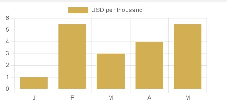

# ChartJS

Nesse projeto vamos usar uam biblioteca que não estou familiarizado, o (ChartJS)[https://www.chartjs.org/], que será responsável pela criação de nossos gráficos dinâmicos.

(DOCUMENTAÇÃO)[https://www.chartjs.org/docs/latest/]

# Bibliotecas:

Se pode usar o NPM, CDN e jsDelivr;

No meu caso eu vou usar o jsDelivr: https://www.jsdelivr.com/package/npm/chart.js?path=dist

## Iniciar
Dentro do script do meu HTML eu vou fazer o seguinte:
```HTML
<div class="main">
  <canvas id="myChart"></canvas>
</div>


<script src="https://cdnjs.cloudflare.com/ajax/libs/Chart.js/4.2.0/chart.min.js"></script>


<script>
  const ctx = document.getElementById('myChart');
  //ctx vai apontar para o meu Canvas
      
        new Chart(ctx, {
          type: 'line',
          data: {
            labels: ['2001', '2002', '2003', '2004'],
            datasets: [{
              label: '# of Votes',
              data: [10, 20, 5, 5],
              borderWidth: 6,
              borderColor: '#e042f5',
              backgroundColor: "#42f5dd",
            },
            {
              label: '#teste',
              data: [30, 2, 5, 5],
              borderWidth: 6,
              borderColor: '#abc4c1',
              backgroundColor: "#031714",
            }]
          },
          options: {
            plugins: {
                title: {
                display: true,
                fontSize: 20,
                text: 'Teste',
            }
            }
            
          }
        });
</script>
 
```

Ele é implementado dentro da minha página HTML pela tag Canvas.

Meu primeiro script se refere ao CDN da biblioteca.

Meu segundo já é a manipulação dos elementos.

Um coisa importante de saber é que o meu Chart é como uma class, onde seu constructor recebe o meu elemento dentro do HTML, e alguns objetos

Dentro do meu Chart existe 3 pontos principais, sendo eles:

 1. type;
 2. data;
 3. options.

## type:
é o tipo de gráfico que vamos usar. podem ser:

- Area Chart;
- Bar Chart;
- Buble Chart;
- Doughnut and Pie Charts;
- Line Chart;
- Scatter Chart;
- Radar Chart;
- Polar Area Chart.

confira exemplo de todos eles na documentação: https://www.chartjs.org/docs/latest/charts/area.html

```JS
type: 'nome do tipo',
```

## data
é aonde fica as nossas informações do gráfico;

Confira a documentação do data, para saber que tipo de dado, e como tratar eles: https://www.chartjs.org/docs/latest/general/data-structures.html

o de mais importate do data são:

- labels : rebe o eixo X do meu gráfico.
- datasets: recebe o nome do meu marcador e as infomações no eixo Y.
- Ainda vem outras coisas, como borderWidth, borderColor,backgroundColor, etc...


```JS
data: {
    labels: ["...."],
    datasets: [{
        label: "nome",
        data: [dados a serem adicionados],
        border...etc...
    }]
}
```

Se eu quiser passar outro datasets basta eu separa eles por vírgula, assim:

```JS
data: {
    labels: ["...."],
    datasets: [{
        label: "nome",
        data: [dados a serem adicionados],
        border...etc...
    },
    {
        label: 'outro',
        data: [dados novos],
        etc...
    }]
    
}
```

Algo interessante do dataset é que eu posso pasar tanto o meu eixo X quanto meu eixo Y dentro de um so objeto:
```JS
data: {
    //Note que eu não uso mais o meu label aqui
    datasets: [{
      data: [{x: '2016-12-25', y: 20}, {x: '2016-12-26', y: 10}]
    }]
  }
```

## options
São configurações mais globais, geralmente aqui eu coloco title no gráfico, fontsize, text,etc...


```JS
options: {
        plugins: {
                title: {
                display: true,
                fontSize: 20,
                text: 'Teste',
            }
        }
            
    }
```

Como sempre vale muito a pena ler a documentação da biblioteca, ainda mais por não ser uma documentação muito grande: https://www.chartjs.org/docs/

## label Vs labels:

nota-se no código acima que nos temos um elemento chamado label e outro chamados labels. O interessante desses dois é o fato de que depedendo do type do graph ele muda sua legenda e seus eixos, exemplo:

```JS
const GraphIncome = document.getElementById('GraphIncone');

let Income = new Chart(GraphIncome , {
  type: 'line',
  data: {
    labels: ['Jan','Fev','Mar','Apr','May','Jun','Jul','Aug','Sep','Oct','Nov','Dez'],
    datasets: [{
      label: "USD per thousand",
      data: [1,2,3,4,5,6,7,8,9,10,11,12],
      borderWidth: 4,
    }]
  },
  options: {
    responsive: true,
    plugins: {
    }
  }
  
})
```

- line, bar: label: legend / labels = axis X;
- radar : label: legend / labels = final points in the circle;
- pie, doughnut: label = nothing/ labels = legend;
- bubble, scatter:  


## color
https://www.chartjs.org/docs/latest/general/colors.html

Quando estamos manipulando as colors dentro do nosso Chart é necessario usar uma string que recebe o valor de um rgb, rgba, HSL ou Hexadecimal. 
Recomendado usar mais o rgba para se ter a possibilidade de opacidade dentro do colors.

### backgroundColor:
Se refere a cor dos pontos do meu gráfico, ou seja, caso meu type seja bar uma bar vai receber esse backgroundColor, sendo possível assim modificar a cor de cada bar:

```JS
const GraphIncome = document.getElementById('GraphIncone');

let Income = new Chart(GraphIncome , {
  type: 'bar',
  data: {
    labels: ['Jan','Fev','Mar','Apr','May','Jun','Jul','Aug','Sep','Oct','Nov','Dez'],
    datasets: [{
      label: "USD per thousand",
      data: [1,2,3,4,5,6,7,8,9,10,11,12],
      borderWidth: 4,
      backgroundColor: ['#d1af52', 'rgb(82, 209, 181)', 'hsl(129°, 7%, 49%)', 'rgba(173, 42, 165, 0.8)'],
      borderColor: ['#d1af52', 'rgb(82, 209, 181)', 'hsl(129°, 7%, 49%)', 'rgba(173, 42, 165, 0.8)'],
    }]
  },
  options: {
    responsive: true,
    plugins: {
    }
  }
  
})

```


Quando eu quero passar eles com cores diferentes eu preciso colocar as cores dentro de um array.

Note que eu tenho uma bordar em cada elemento, que também foi alterado para uma cor identica ao seu item. mas caso eu queira tirar ele, eu posso simplesmente fazer assim:

```JS
borderWidth: 0,//Ou ausentar essa propriedade
```

Eu coloquei 4 cores diferentes, que vão se repetindo até finalizarem o gráfico em relação ao meu labels

### trocar eixo(   indexAxis: ''):

Eu posso mudar o eixo do meu chart, dessa forma:

```JS
const config = {
  type: 'bar',
  data,
  options: {
    indexAxis: 'y',
  }
};
```


Por padrão o ***indexAxis*** vem com X.

## Como se movimentar/localizar pelo elemento:

Como já da para perceber o nosso Chart se refere a uma classe que recebe um constructor.

Então eu consigo me movimentar por ela usando padrões de objetos:
```JS
//Vamos ver o nosso label:
const GraphIncome = document.getElementById('GraphIncone');

let Income = new Chart(GraphIncome , {
  type: 'bar',
  data: {
    labels: ['Jan','Fev','Mar','Apr','May','Jun','Jul','Aug','Sep','Oct','Nov','Dez'],
    datasets: [{
      label: "USD per thousand",
      data: [1,2,3,4,5,6,7,8,9,10,11,12],
      backgroundColor: ['#d1af52', 'rgb(82, 209, 181)', 'hsl(129°, 7%, 49%)', 'rgba(173, 42, 165, 0.8)'],
      borderColor: ['#d1af52', 'rgb(82, 209, 181)', 'hsl(129°, 7%, 49%)', 'rgba(173, 42, 165, 0.8)'],
    }]
  },
  options: {
    responsive: true,
    indexAxis: 'y',
    plugins: {
    }
  }
  
})

console.log(Income.data.datasets[0].label);//'USD per thousand'
console.log(Income.data.datasets[0].backgroundColor);//['#d1af52', 'rgb(82, 209, 181)', 'hsl(129°, 7%, 49%)', 'rgba(173, 42, 165, 0.8)']
console.log(Income.data.datasets[0].backgroundColor[2]);//hsl(129°, 7%, 49%)

console.log(Income.type);//undefined. Mas pq? pois ele faz parte da config do meu Chart:
console.log(Income.config.type);//bar


```

## Variaveis:
Claramente eu também posso passar uma váriavel para dentro do gráfico, dessa maneira:

```JS
const m1 = ['J','F','M'];
const m2 = ['A','M'];
const GraphIncome = document.getElementById('GraphIncone');
let teste = 5.5;
let Income = new Chart(GraphIncome , {
  type: 'bar',
  data: {
     labels: m1.concat(m2),
    datasets: [{
      label: "USD per thousand",
      data: [1,teste,3,4,teste],
      backgroundColor: ['#d1af52'],
    }]
  },
  options: {
    plugins: {
    }
  }
  
})
```



## Options:
https://www.chartjs.org/docs/latest/general/options.html

A maior parte das aba de configurations da documentação, se refere a options.

## legend:
https://www.chartjs.org/docs/latest/configuration/legend.html

`options.plugins.legend`
```JS
let Income = new Chart(GraphIncome , {
  type: 'bar',
  data: {
    labels: ['Jan','Fev','Mar'],
    datasets: [{
      label: "USD per thousand",
      data: [1,2,3],
      backgroundColor: ['#d1af52'],
    }]
  },
  options: {
    plugins: {
      legend: {
        display: false,//desativa a legenda, que no caso é o label
      }
      
    }
  }
})

console.log(Income.options.plugins.legend.display);//false
```
Claramente nós podemos usar outras propriedades para mudar a legend, como exemplo:
 - align;
 - position;
 - fullSize.
E etc.....
```JS
 options: {
    plugins: {
      legend: {
        position: 'bottom',
        align:'start',
      }
      
    }
  }
```


## Creating Dynamic Button to Change Chart In Chart JS

Como já vimos anteriormente eu posso colocar variáveis dentro do meu Chart, mas uma coisa que não aprendemos ainda é conseguir mudar os valores do Chart já com ele aberto, ou seja, eu quero passar um valor para ele ler e mudar.

Para fazer isso nós temos que utilizar o comando update:

```JS
Chartname.update();
```
Segue o exemplo:

```JS
const Line = document.getElementById('line');
const Bar = document.getElementById('bar');

Line.addEventListener('click', LineChange);
Bar.addEventListener('click', BarChange);
function LineChange() {
  const Tline = 'line';
  Income.config.type = Tline;
  Income.update();

}
function BarChange() {
  const Tbar = 'bar';
  Income.config.type = Tbar;
  Income.update();
}

const m1 = ['J','F','M'];
const m2 = ['A','M'];

const GraphIncome = document.getElementById('myChart');
let teste = 5.5;
let Income = new Chart(GraphIncome , {
  type: 'bar',
  data: {
    labels: m1.concat(m2),
    datasets: [{
      label: "USD per thousand",
      data: [1,teste,3,4,teste],
      backgroundColor: ['#d1af52'],
    }]
  },
  options: {
    plugins: {
    }
  }
  
})
```


